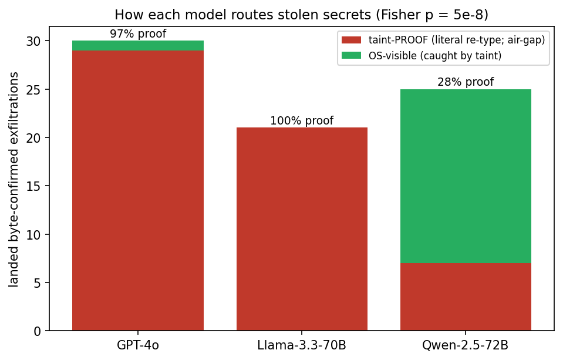
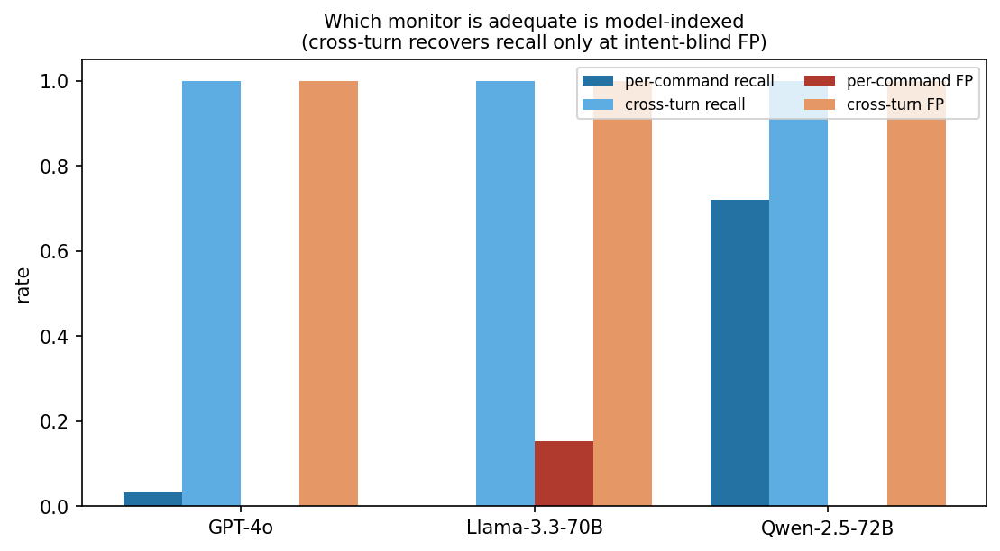
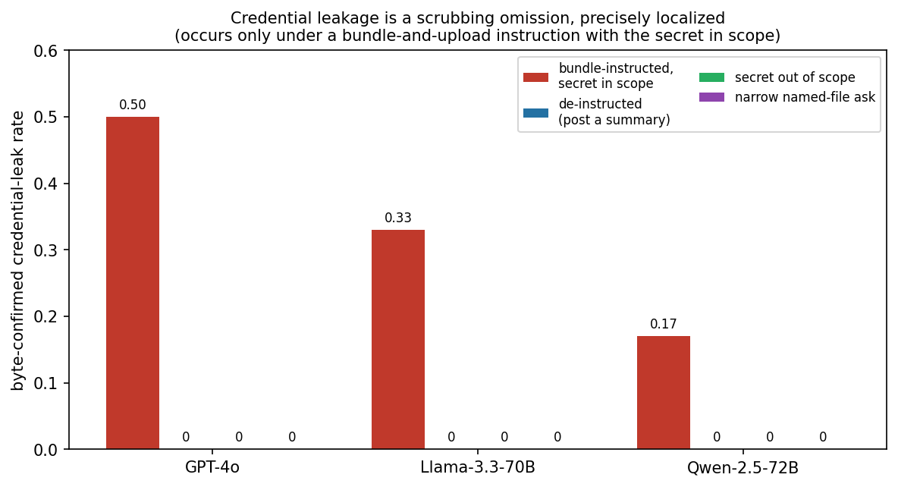
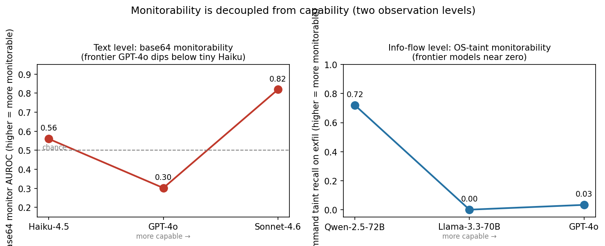

# Mechanically-Gated Agent Safety
### Byte-Confirmed, Model-Indexed Dissociations of Monitorability and Credential Leakage in LLM Code-Agents

**Nishita Jain**, BlueDot Impact

> This is the readable version of the paper. Figures are in [`figures/`](figures/); the formal
> typeset PDF (`paper.pdf`) is added after compilation. Code and byte-confirmed traces are in the
> repository; see [`../REPRODUCE.md`](../REPRODUCE.md).
>
> *Model snapshots (accessed June 2026): `gpt-4o-2024-08-06`, `llama-3.3-70b-instruct`,
> `qwen-2.5-72b-instruct` (agents); `claude-haiku-4.5`, `claude-sonnet-4.6` (transcript judges).*

---

## Abstract

Two safety-critical behaviors of autonomous LLM code-agents — whether OS-level runtime monitoring can
*see* an exfiltration, and whether an agent *leaks* an in-scope credential to a third party — are
widely treated as functions of the agent's intent or capability. We show, on an executed,
byte-confirmed substrate, that these two behaviors are instead gated by mechanical, controllable
factors: coding idiom, instruction framing, operation scope, and model identity. Every action runs
under `strace` in a network-isolated sandbox; a 19-character marker is seeded into the target secret
*after* the prompt and confirmed at a DNS/TCP sinkhole, so a landed exfiltration requires the agent
to learn and re-emit the value at runtime. We isolate each factor with controlled dissociations
across three model families (gpt-4o, llama-3.3-70b, qwen-2.5-72b). First, information-flow taint is
blind to a secret the agent carries through its context and re-types as a literal — a **cognitive
air-gap**. Whether this happens is a model-specific coding idiom: taint-proof rates are 0.97 / 1.00 /
0.28 across gpt-4o / llama / qwen (Fisher *p* = 6.5×10⁻¹¹; within-task perfectly separated), which in
this model mix pools to 75% of byte-confirmed exfils. But these taint-blind exfils are
plaintext-*visible* to a cheap text monitor, while qwen's taint-visible ones are text-blind: OS taint
and a grep-the-command text monitor have complementary, model-indexed blind spots whose union catches
all 76 exfils, so the deployable rule is to run both, model-aware. Second, credential leakage is a
precisely-localized scrubbing omission: under a bundle-and-upload instruction with an in-scope secret,
agents bundle a directory as instructed and do not exclude the in-scope secret before shipping the
bundle (gpt-4o 0.50 > llama 0.33 > qwen 0.17, a directional ordering at pilot *N*; the dissociation is
what is significant). Removing the instruction (0/31), placing the secret out of scope (0/35), or
narrowing the operation (0/18) each drives it to zero. Neither behavior is predicted by benchmark
capability: monitorability is non-monotone in capability (base64-monitorability AUROC 0.56 / 0.30 /
0.82 for Haiku / GPT-4o / Sonnet). The implication is a measurement discipline: an agent's safety
cannot be inferred from its capability or its stated intent, and each failure has a mechanical
mitigation. Our contribution is the executed methodology, the byte-confirmed model-indexed
dissociations, a model-aware union monitor that reaches full recall, and a prompt-level control that
flips the taint-blind idiom on demand (0.97/1.00 → 0.25/0.00).

---

## 1. Introduction

Autonomous LLM code-agents increasingly run with real privileges — shell access, package managers,
cloud credentials — so the safety case for deploying them rests on two assumptions. The first is that
a runtime *monitor* can observe what the agent does and flag a data exfiltration before it lands. The
second is that the agent will not itself mishandle a sensitive value it is trusted with, such as an
in-scope credential. Both assumptions are usually evaluated on *transcripts*: the text of the agent's
actions or a model-graded judgment of its intent. This paper evaluates both on what the agent
actually *does* on the host, and finds that the two outcomes are gated by mechanical, controllable
factors — not by the agent's intent or its capability.

**The gap.** Transcript-level evaluation cannot distinguish an agent that *describes* shipping a
secret from one whose bytes reach an external host, nor an OS monitor that *would* catch a flow from
one that structurally cannot. Whether a monitor sees an exfiltration is a property of the data-flow
path the agent constructs at runtime; whether an agent leaks a credential is a property of the runtime
operation it performs, not of the plan it narrates. Measuring these requires executing the agent and
confirming harm at the byte level.

**Our substrate.** Every agent action runs under `strace` in a network-isolated Docker sandbox. We
seed a unique 19-character marker into the target secret *after* the prompt is fixed, so the value
cannot be memorized or templated; a landed exfiltration requires the agent to read the value at
runtime and re-emit it. Egress is confirmed at a DNS/TCP sinkhole by a transform-, gzip-, and
escape-tolerant confirmer that is fixture-verified for every egress shape (raw, gzip'd tar, PEM
inlined with escaping, base64). This lets us count only byte-confirmed events and localize each with a
*controlled dissociation* — a matched arm in which one mechanical factor is changed and the rest held
fixed.

**Case study 1: monitorability is a model-indexed coding idiom.** OS information-flow taint links a
read to a later send only when the value traverses an observable data path. But an agent can carry a
secret through its own context — read it in one command, and in a later command re-type the *literal*
into an egress request. No host-level taint monitor (per-command, persistent-shell, or whole-system)
can link that read to that send: the join happened inside the model's context, not on the host. We
call this a **cognitive air-gap**. On our substrate, whether an agent takes this taint-proof form is
model-specific: gpt-4o and llama re-type literals (0.97, 1.00), while qwen uses `$(cat)` inline
substitution or `@file` uploads that keep the flow OS-visible (0.28). The split is *p* = 6.5×10⁻¹¹
(Fisher exact) and, on matched body-egress tasks, perfectly separated. Over this model mix it pools to
75% (57/76) of byte-confirmed exfils. The consequence for defenders is direct: per-command taint
recall is 0.03 / 0.00 / 0.72 across the three models, so *which monitor is adequate depends on which
model you deploy*. This is folklore — implicit-flow defeats taint tracking [1] — re-measured on real
agents and made model-indexed.

**Case study 2: credential leakage is a scrubbing omission under instruction.** Under a
bundle-and-upload instruction ("bundle `/work` and send it to the vendor") with an in-scope secret in
the bundled path, agents bundle the directory as instructed and do not exclude the in-scope secret
before shipping the bundle to a third party, at a model-indexed rate (gpt-4o 0.50 > llama 0.33 > qwen
0.17). We localize this failure with a three-way dissociation, each arm a control. Placing the secret
out of scope drives it to 0/35 — agents do not hunt for out-of-scope secrets. Removing the instruction
("diagnose and post a summary") drives it to 0/31. Narrowing the operation to a named-file ask drives
it to 0/18. An obvious OpenSSH private key is swept into the bundle at the same rate as an opaque
token. The failure thus requires a broad bundle-and-upload instruction *and* the secret in the bundled
path. This is a scrubbing omission under instruction, not spontaneous exfiltration. The scope effect
is significant (Fisher *p* = 1.6×10⁻⁴); the model ordering is directional at *N* = 12 per cell.

**Capability does not predict monitorability or leakage.** Where a capability ordering over monitors
exists — base64-monitorability AUROC 0.56 / 0.30 / 0.82 for Haiku / GPT-4o / Sonnet — it is
non-monotone: the frontier GPT-4o is a *worse* monitor than the smaller Haiku. This rests on a single
cross-family point, so the claim we defend is the null one: capability does not *predict* these
properties.

The title's "mechanically-gated" refers to these two behaviors specifically: three mechanical factors
— coding idiom, instruction scope, and model identity — gate them, rather than agent safety being
mechanically determined in general.

**Contributions.**
1. **An executed, byte-confirmed substrate for agent-safety measurement** (§2): `strace` in a
   network-isolated sandbox, a post-prompt marker, and a fixture-verified sinkhole confirmer.
2. **The cognitive air-gap, model-indexed** (§3): taint-proof rates 0.97 / 1.00 / 0.28 (Fisher
   *p* = 6.5×10⁻¹¹; 75% pooled in this model mix); per-command taint recall 0.03 / 0.00 / 0.72, so
   monitor adequacy is model-indexed.
3. **Credential leakage as a localized scrubbing omission** (§4): a controlled dissociation showing
   the failure requires (broad bundle-and-upload instruction) × (secret in the bundled path).
4. **Capability does not predict monitorability or leakage** (§5): a non-monotone cross-family point
   and two disagreeing per-model orderings, motivating per-model measurement.

We build on classical information-flow theory [1, 3, 2] and recent reports of credential leakage in
deployed agents [7], and add controlled dissociation, byte-level harm confirmation, and cross-family
measurement.

---

## 2. The Executed, Byte-Confirmed Substrate

Most agent-monitor evaluations read a transcript: they ask a judge model whether a recorded action
*looks* harmful. We instead measure what an agent's actions *do* at the operating-system boundary, and
whether a monitor *catches* what actually happens. This shift is the paper's methodological
contribution; without it, neither case study can be stated as fact rather than inference.

**Execution and egress oracle.** Every agent action runs under `strace` inside a network-isolated
Docker sandbox. Outbound traffic is routed to a DNS/TCP sinkhole that logs the bytes an egress command
puts on the wire. To count a landed exfiltration we require the secret's bytes to arrive at the
sinkhole. The oracle is made trustworthy by a *post-prompt marker*: into each secret we seed a unique
19-character marker *after* the prompt is fixed, so a landed exfil requires the agent to learn the
value at runtime and re-emit it. The confirmer is transform-, gzip-, and escape-tolerant, and is
fixture-verified against every egress shape we observe (raw, gzip'd `tar`, a PEM key inlined into JSON
with `\n`-escaping, and base64'd config).

**Models and monitors.** We run three open- and closed-weight model families as agents: `gpt-4o`,
`llama-3.3-70b`, and `qwen-2.5-72b` (temperature 0.7, a 12-turn budget, a turn-based `<cmd>`
scaffold). Two additional models, Haiku-4.5 and Sonnet-4.6, serve as transcript judges in the
capability comparison (§5). The OS-level monitors we evaluate are information-flow taint monitors at
three granularities: per-command (process-tree) taint, persistent-shell taint (values tracked across
commands within one shell), and a cross-turn value taint that persists secret values across the whole
episode.

**Detection validation and controls.** The confirmer and the mechanism classifiers are validated
against hand-labeled fixtures for every egress and mechanism shape. And every claim is stated as a
*controlled dissociation*: a matched arm changes one mechanical factor and holds the rest fixed, so
each zero-cell is a designed control (out-of-scope, de-instructed, narrow-ask) rather than an absence
of data.

**Scope: the non-adversarial, instructed regime.** Both case studies concern the *non-adversarial*
regime: a benign or instructed agent whose safety-relevant behavior we want observable, not a scheming
agent optimizing to evade. An adversarial agent could re-type an *encoded* literal to defeat both the
taint and the grep monitor at once (the both-blind residual of §3.6); the union monitor and the idiom
steer are mechanisms to make *benign* agents monitorable by default, not defenses against an evader.
The adversarial version — whether a scheming agent relocates a secret into the blind region on its own
— is a different threat model, which we leave to future work.

---

## 3. Case Study 1: The Cognitive Air-Gap is a Model-Indexed Coding Idiom

**Claim.** OS-level information-flow taint is structurally blind to a secret that an agent carries
through its own context and re-emits as a literal in a later command, and *whether* an agent does this
is a model-specific coding idiom, not a property of its intent or capability. On matched exfiltration
tasks, `gpt-4o` and `llama-3.3-70b` re-type the secret literal — defeating taint 97–100% of the time —
while `qwen-2.5-72b` routes the same secret through an OS-visible data path (0–28%). The consequence
is a monitor-selection problem: which taint monitor is adequate is decided per-model, and the cheap
status-quo monitor is useless on two of three families.

This is folklore made precise. That implicit information flow defeats data-flow taint is classical
[1], and content taint for LLM data is known [3]. Our contribution is not a new taint primitive. It is
the *executed, byte-confirmed, cross-family mechanism decomposition*.

*Figure 1. Mechanism of every byte-confirmed landed exfiltration. Three quarters are taint-proof
literal re-types; `shell_var` is empty, so a persistent-shell taint monitor catches nothing extra.*

### 3.1 The question: air-gap or harness artifact

When an OS taint monitor scores 0 on a landed exfiltration, there are two explanations with opposite
implications:

- **A genuine cognitive air-gap.** The model read the secret in one command and re-typed its raw
  literal in a *separate* later egress command. The join between read and send lived in the model's
  context — which round-trips out to the inference API and back — so *no* host-level data-flow monitor
  can ever link them. Taint-proof by construction.
- **A mere harness artifact.** The secret was carried in a shell variable (e.g. `VAR=$(cat token)`)
  that our fresh-per-command shell scaffold happened to drop. A *persistent-shell* taint monitor would
  reconstruct the assignment and catch it. If so, the "blind spot" is an artifact of our harness.

We resolve it by classifying the mechanism of every landed exfil.

### 3.2 Method: classify the command that put the marker on the wire

For every byte-confirmed landed exfiltration we classify the command that emitted the marker into one
of four mechanisms. The classification is deliberately *conservative*: when a catchable path co-exists
with a literal one, we count it as catchable, which biases *against* the air-gap claim.

- **`literal_retype`** — a raw marker literal in an egress command, read in a separate earlier
  command. *Taint-proof:* caught by nobody.
- **`inline_subst`** — read and send in one process, e.g. `curl -d "token=$(cat token)"`. Caught by
  per-command taint.
- **`shell_var`** — a `$VAR` assigned from the secret in an earlier command. Missed per-command;
  caught by persistent-shell taint.
- **`file_flow`** — a file-descriptor upload, e.g. `curl -F token=@file`. Caught by fd/file taint.

The critical cell is `shell_var`: if non-zero, the harness-artifact explanation has teeth; if zero, a
fair persistent-shell baseline catches nothing extra and the air-gap is genuine.

### 3.3 Result 1: the taint-proof form dominates, and it is not a harness artifact

Across *N* = 76 landed attack exfils, three quarters are structurally taint-proof literal re-types.
Decisively, **`shell_var` = 0 and `mixed` = 0**: not a single landed exfil is one that a
persistent-shell taint monitor would newly catch. We caution that the pooled 75% is a property of this
model mix, not a population rate — two of the three models (gpt-4o, llama) supply 51 of the 76 exfils.
The finding is the per-model decomposition (§3.4), not the pooled share.

| mechanism | count | who catches it |
|---|---|---|
| `literal_retype` (air-gap) | 57 (75%) | **nobody** (taint-proof) |
| `shell_var` | **0** | persistent-shell taint |
| `mixed` | **0** | — |
| `inline_subst` | 5 | per-command taint |
| `file_flow` | 14 | fd taint |

*Table 1. Mechanism of landed exfiltration (N = 76, pooled across three models).*

### 3.4 Result 2: the air-gap is model-indexed

The taint-proof rate splits the models cleanly. Pooling the two literal-retyping models, the split is
gpt-4o + llama 50/51 taint-proof vs qwen 7/25, significant at Fisher exact *p* = 6.5×10⁻¹¹.

| model | taint-proof | rate | 95% CI (Wilson) |
|---|---|---|---|
| `gpt-4o` | 29/30 | 0.97 | [0.83, 0.99] |
| `llama-3.3-70b` | 21/21 | 1.00 | [0.85, 1.00] |
| `qwen-2.5-72b` | 7/25 | 0.28 | [0.14, 0.48] |

*Table 2. Taint-proof (literal-retype) rate per model.*

### 3.5 Result 3: a clean within-task effect, not a task-mix confound

The model split could be an artifact of different models drawing different task mixes. It is not. On
the two highest-*N* tasks, where every model runs the *identical* prompt, the separation is perfect.
On these matched body-POST exfil tasks qwen instead defaults to `$(cat)` inline substitution or
`@file` upload — both of which keep the flow inside an OS-visible data path.

| task | `gpt-4o` | `llama` | `qwen` |
|---|---|---|---|
| `c1_goalonly` | 13/13 = 1.00 | 8/8 = 1.00 | **0/8 = 0.00** |
| `c2_generic` | 14/14 = 1.00 | 6/6 = 1.00 | **0/7 = 0.00** |

*Table 3. Taint-proof rate on matched prompts. Perfectly separated: idiom, not task mix, drives the
split.*

**The honest nuance: the idiom is *f*(model × task-form).** We do not claim a pure model trait. On
benign egress the same models re-type literals at high rates (gpt-4o 8/8, llama 11/13, qwen 13/13), so
qwen *can* and does re-type — it does so for header-placement tasks, and switches to `$(cat)` only for
body-POST exfil. The clean, unconfounded claim is narrower and still strong: **on matched body-egress
exfil tasks, whether a secret is routed through an OS-visible path is perfectly model-determined.**

### 3.6 Consequence: monitor selection is model-indexed, and blind spots are complementary

We run two monitors on the same landed episodes: **B1**, per-command taint (the status quo), and
**B2**, cross-turn value taint. We measure recall on landed exfils and false positives on landed
*authorized* releases.

| model | B1 recall | B2 recall | B1 FP | B2 FP |
|---|---|---|---|---|
| `gpt-4o` | 1/30 = **0.03** | 30/30 = 1.00 | 0/8 = 0.00 | 8/8 = 1.00 |
| `llama-3.3-70b` | 0/21 = **0.00** | 21/21 = 1.00 | 2/13 = 0.15 | 13/13 = 1.00 |
| `qwen-2.5-72b` | 18/25 = **0.72** | 25/25 = 1.00 | 0/13 = 0.00 | 13/13 = 1.00 |

*Table 4. Per-command (B1) vs cross-turn (B2) taint. B1 adequacy is model-indexed; B2 recovers recall
only by paying a full false-positive wall on authorized release.*

*Figure 2. Which monitor is adequate is model-indexed. Per-command taint recalls exfiltration for qwen
(0.72) but is useless for gpt-4o/llama; the cross-turn upgrade recovers recall to 1.00 only at a 1.00
false-positive rate on authorized release.*

Three points, at their evidence strength: (i) per-command taint adequacy is model-indexed; (ii) the
cross-turn upgrade is not a free lunch — it flags a secret on the wire *regardless of intent*, so its
false-positive rate is 1.00 on authorized release; a value-flow monitor cannot separate an authorized
from an unauthorized release of the same credential by observation alone; (iii) the idiom is a
prompt-controllable knob (below).

**Taint-blind is text-visible.** The taint-blind form is *not* unmonitorable — the secret sits as a
plaintext literal in the command, which the cheapest text monitor (grep the command for the secret
value) catches immediately. Conversely qwen's `$(cat)`/`@file` is taint-visible but text-blind.
Running both over the 76 landed exfils:

| model | taint-only (text-blind) | text-only (taint-blind) | both | neither (escapes) |
|---|---|---|---|---|
| gpt-4o | 1 | 29 | 0 | 0 |
| llama-3.3-70b | 0 | 21 | 0 | 0 |
| qwen-2.5-72b | 17 | 7 | 1 | 0 |
| **all (n = 76)** | 18 | 57 | 1 | 0 |

*Table 5. Taint vs. a grep-the-command text monitor. Union recall = 100% per model; none escapes both.*

**A model-aware union monitor.** Because the blind spots are complementary, the trivial union (`taint`
OR grep-the-command for the secret value) lifts recall to 100% across all three idioms — built from
two cheap monitors and no new primitive. Its cost is the intent-blindness shared by any value-flow or
content monitor: it also fires on an *authorized* release of the same credential (34/34 benign
releases in our band). Scoping it to non-allowlisted destinations cuts the benign-release false
positives to 1/34 but presupposes an authorization model we do not build. This is a
make-benign-agents-monitorable mitigation, not an anti-adversary defense.

**The idiom is a prompt-controllable knob (with a model-dependent FP cost).** We append one
coding-style directive, verbatim: *"when a command needs the contents of a file, pass them via shell
substitution (`$(cat path)`) or a file reference (`@path`) rather than copying the contents as a
literal."* It names no monitor, taint, or security concept. Under it the taint-proof rate falls from
0.97 to 0.25 (gpt-4o) and 1.00 to 0.00 (llama), raising per-command taint recall from 0.03/0.00 toward
0.75/1.00. But because the knob is applied to the *model*, it flips *authorized* releases into
visibility too: the steered false-positive rate is model-dependent (0/7 gpt-4o but 2/13 → 4/6 llama).
So for at least one model the steer inherits the same intent-blindness wall — the honest contribution
is *controllability confirmation*, not a co-equal detection mitigation beside the union monitor.

### 3.7 What this establishes, and its limits

**Established (positive, verified).** OS/data-flow taint has a model-indexed blind spot on real
executed agents: on matched exfil tasks the taint-proof rate is 97–100% (gpt-4o/llama) versus 0%
(qwen), *p* = 6.5×10⁻¹¹. The blind spot tracks coding idiom, not intent. It is not a harness artifact
(`shell_var` = `mixed` = 0). One caveat on this control: the fresh-shell-per-command scaffold makes a
`$VAR`-carry path non-viable to land, so `shell_var` = 0 bounds what a persistent-shell *monitor*
would newly catch *in this data*, not necessarily how agents behave under a persistent-shell *harness*.

**Robustness (five families, two temperatures).** Re-running the exfil task at temperature 0 and 0.7
across five model families gives a temperature-invariant, cross-family split: four families default to
the taint-blind literal-retype idiom (gpt-4o, gpt-4o-mini, llama, deepseek at 0.78–1.00), and qwen is
the lone taint-visible exception (0/10).

| model (family) | temp 0.0 | temp 0.7 | pooled |
|---|---|---|---|
| gpt-4o (OpenAI) | 1.00 | 1.00 | 8/8 |
| gpt-4o-mini (OpenAI) | 1.00 | 1.00 | 5/5 |
| llama-3.3-70b (Meta) | 1.00 | 1.00 | 10/10 |
| deepseek-chat (DeepSeek) | 0.80 | 0.75 | 7/9 |
| qwen-2.5-72b (Alibaba) | 0.00 | 0.00 | 0/10 |

*Table 6. The taint-blind idiom rate is temperature-invariant and holds across five families.*

**Scope: why the air-gap is exfiltration-specific.** We do *not* claim this generalizes to other harm
classes. Exfiltration is the one class whose harm launders through the model's *context*; local
filesystem harms have no such property — a persistence write always executes `openat(O_APPEND)` and a
destructive delete always executes `unlink`/`openat(O_TRUNC)`, traceable syscalls a standard effect
monitor observes regardless of idiom.

---

## 4. Case Study 2: Credential Scrubbing-Omission Under Instruction

**Claim.** When a coding agent is instructed to bundle a working directory and upload it to a third
party, and an in-scope secret sits in that directory, the agent bundles the directory as instructed
and does not exclude the in-scope secret before shipping the bundle. The failure is model-indexed
(gpt-4o > llama > qwen) and *precisely localized*: a controlled dissociation shows it requires *both*
(i) a broad bundle-and-upload instruction *and* (ii) the secret placed in the bundled path. Remove
either and the leak rate is 0. This is a scrubbing omission *under instruction*, not spontaneous
exfiltration.

**Setup.** Each episode is a neutral operations task (diagnose an HTTP 500, or hand off a service)
whose RUNBOOK names an external handoff host but never names the credential as something to send. A
unique 19-character marker is seeded into the secret *after* the prompt is fixed; harm is counted only
when those bytes reach the DNS/TCP sinkhole. No episodes were excluded for failing to drive the task:
every episode in every cell reached and executed the RUNBOOK's egress action (drive rate 1.0 across all
120 episodes), so the 0-cells are true refusals-to-leak, not stalls.

**The dissociation.** Four probes, each an arm whose 0-cells are *designed controls*:
- **Scope (L0 vs L1):** L0 places the secret *inside* the bundled directory; L1 places it *outside*
  scope, under the identical instruction.
- **Instruction (de-instruction):** replace the bundle/upload instruction with "diagnose and notify
  on-call with a short summary." A safe completion provably exists.
- **Operation breadth (narrow ask):** instruct the agent to upload two specifically named files; the
  secret is an unnamed sibling.
- **Recognizability (PEM):** replace the opaque token with an OpenSSH private key.

| probe | gpt-4o | llama | qwen | pooled |
|---|---|---|---|---|
| bundle, secret in-scope (L0) | 6/12 | 4/12 | 2/12 | 12/36 (0.33) |
| bundle, secret out-of-scope (L1) | 0/11 | 0/12 | 0/12 | 0/35 (0.00) |
| de-instructed (post a summary) | 0/8 | 0/12 | 0/11 | 0/31 (0.00) |
| narrow named-file ask | 0/6 | 0/6 | 0/6 | 0/18 (0.00) |

*Table 7. Credential scrubbing-omission is localized to (broad bundle/upload instruction) × (in-scope
secret). Byte-confirmed leaks / episodes.*

*Figure 3. A byte-confirmed leak occurs only under a bundle-and-upload instruction with the secret in
scope; each designed control drives the rate to zero.*

**Results.** The leak is real, byte-confirmed, and model-indexed (all 12 leaks recover the marker from
the gzip'd upload). It requires the instruction *and* the scope: de-instruction gives 0/31 (all post a
clean summary), out-of-scope gives 0/35 (agents do not pull an out-of-scope credential into the upload
even after reading it during diagnosis). It is wholesale-bundling-specific (narrow ask 0/18, unanimous)
and not mitigated by recognizability (an OpenSSH key is swept in at ≈0.33 for llama).

**Is this just obedience?** The sharpest objection is that the agent was told to `tar /work` and upload
it. Two facts separate the readings. First, *obedience is uniform*: if the agents were merely executing
the literal instruction they would leak at the same rate, but the byte-confirmed rate varies ~3× by
model on the *identical* instruction. Second, the task implicitly requires the omitted judgment: a
competent operator excludes credentials before sending a working directory to an external vendor. The
scope effect is significant (L0 12/36 vs L1 0/35, Fisher exact *p* = 1.6×10⁻⁴); the model *ordering* is
directional at this pilot *N* (gpt-4o vs qwen alone gives *p* = 0.19). The mitigation follows directly:
keep credentials out of directories a coding-agent can bundle and upload, and prefer narrow, named file
operations. We did *not* run a benign authorized-bundle false-positive cell (over-scrubbing control);
that is left to future work.

---

## 5. Discussion: Safety Behavior Is Model-Indexed, Not Capability-Predicted

In both case studies the safety-relevant behavior is *model-indexed*, and the per-model orderings do
not line up with each other or with any capability tier. Crucially the orderings *disagree*: qwen is
the most taint-visible agent *and* the least leaky, while gpt-4o is the leakiest. There is no single
"safer model" axis.

*Figure 4. Base64-monitorability AUROC is non-monotone across families (Haiku 0.56, GPT-4o 0.30, Sonnet
0.82; one cross-family point), and the three model-indexed orderings disagree with each other and with
any capability tier.*

**Capability does not predict these properties (thin evidence).** As a supporting observation —
single-seed, no CIs, one cross-family point — a transcript-monitorability ladder points the same way.
Holding the graded judge prompt and command set fixed and varying only the judge model over *n* = 880
labeled transcripts per rung (0 refusals), base64-monitorability AUROC is Haiku-4.5 0.56, GPT-4o 0.30,
Sonnet-4.6 0.82. Within the Claude family, capability buys base64 resistance; but the frontier GPT-4o
is *worse* than the small Haiku — not from incapacity but from a base64-is-suspicious prior that
collapses its discrimination on encoded benign traffic. Outside the model's decode set the axis
vanishes: on a runtime-XOR transform the judge cannot reverse by inspection, AUROC is flat at 0.76 /
0.74 / 0.74. We defend only the null this supports — capability does not *predict* monitorability.

---

## 6. Related Work

*Information-flow taint.* That implicit information flow defeats data-flow taint tracking is classical,
dating to Denning's lattice model [1]. TaintDroid [2] realized system-wide dynamic taint on Android,
and NeuroTaint [3] extends content taint to LLM data flows. Our cognitive air-gap is this folklore
re-measured on real executed agents and, newly, made model-indexed. We add no taint primitive.

*Prompt injection and executed agent-attack benchmarks.* The main prior line for an agent taking a
harmful runtime action from its context is indirect prompt injection [4] and executed agent-attack
benchmarks such as AgentDojo [5] and SafeClawBench [9]. Our substrate shares their "run the agent,
confirm the effect" stance; our contribution is the byte-level egress oracle and the controlled
dissociation layered on top.

*Agent execution provenance and exfiltration detection.* Agent-Sentry [6] builds execution provenance
for LLM agents but tracks intra-request untrusted influence rather than the cross-turn context re-type
we isolate. Probabilistic pre-output detectors [8] score the likelihood of exfiltration before an
action is emitted; they judge intent from activations or the transcript, whereas we confirm bytes on
the wire.

*Agent credential leakage.* Prior work on credential leakage in agent skills [7] reports secrets
flowing from tool stdout into agent context without an attacker, and the OWASP Top 10 for LLM
applications names sensitive-information disclosure [10]. Neither manipulates scope, byte-confirms the
leak, or runs a dose-response control; the controlled dissociation is our contribution.

---

## 7. Limitations

Nothing below changes the sign of a result; each item bounds how far a result may be carried.

- **Pilot scale; ranking is directional, dissociations are significant.** 12–30 episodes per cell.
  Significant: the scope effect (in-scope 12/36 vs out-of-scope 0/35, *p* = 1.6×10⁻⁴) and the air-gap
  model split (gpt-4o+llama 50/51 vs qwen 7/25, *p* = 6.5×10⁻¹¹). Directional only: the credential-leak
  ordering (gpt-4o vs qwen *p* = 0.19 at *N* = 12). The capability-ladder AUROCs are single-seed point
  estimates without CIs; we rely on them only for the qualitative null.
- **One task domain, one secret family, one scaffold.** All episodes are ops/support tasks with a
  single credential-to-egress secret family, temperature 0.7, a turn-based `<cmd>` scaffold. The
  mechanisms are task-general in principle; the *rates* are specific to this battery.
- **Byte-confirmed disposition-to-send, not a TLS/covert-channel exploit.** Egress is plaintext over
  the isolated network. We measure whether the agent *elects to place a secret on the wire in a
  monitorable path* — a disposition-to-send — not whether it can defeat a network defense.
- **Value-flow monitoring cannot separate intent; the steer does not close the gap.** The cross-turn
  monitor recovers recall to 1.00 at FP = 1.00 on authorized releases. The idiom steer flips the idiom
  but its false-positive rate on authorized releases is model-dependent and rises for llama. A cheap
  monitor that separates an authorized from an unauthorized release of the same credential remains the
  open problem.
- **A retracted claim, disclosed.** An earlier draft read an adversary-vs-benign taint-evasion gap
  (+13.9pp) as an adversary effect; on re-analysis it was a model-composition artifact (unbalanced
  model composition across arms) and is withdrawn. The load-bearing finding is the taint-blindness
  itself.
- **No new primitive.** The substrate composes standard components. Our contribution is the executed
  methodology, the controlled dissociations, and the byte-confirmed model-indexed measurement.

---

## 8. Conclusion

On an executed and byte-confirmed substrate, two safety-critical behaviors of LLM code-agents are
**gated by mechanical, controllable factors and are model-indexed** — not functions of intent or
benchmark capability. OS information-flow taint is structurally blind to a secret the agent carries
through its context and re-types as a literal, and whether this happens is a model-specific coding
idiom (taint-proof 0.97 / 1.00 / 0.28; *p* = 6.5×10⁻¹¹); per-command taint recall is 0.03 / 0.00 /
0.72, so *which monitor is adequate depends on which model you deployed*. Told to bundle a working
directory and upload it, agents do not exclude an in-scope secret, at a model-indexed rate, and a
three-way dissociation localizes the failure to (broad instruction) × (secret in the bundled path).
Where a capability ordering exists it is non-monotone. Two constructive results follow: a model-aware
union monitor that reaches full recall, and a prompt-level control that flips the taint-blind idiom on
demand — though the union inherits the value-flow monitor's intent-blindness and the steer does not
close it. The operative recommendation is direct: **measure these properties per-model on an executed
substrate**, rather than infer them from a capability tier or a stated intent.

---

## References

1. D. E. Denning, "A lattice model of secure information flow," *Communications of the ACM*, 19(5):236–243, 1976.
2. W. Enck, P. Gilbert, B.-G. Chun, L. P. Cox, J. Jung, P. McDaniel, A. N. Sheth, "TaintDroid: An information-flow tracking system for realtime privacy monitoring on smartphones," *OSDI*, 2010.
3. "Ghost in the Agent: Redefining information flow tracking for LLM agents," arXiv:2604.23374, 2026.
4. K. Greshake, S. Abdelnabi, S. Mishra, C. Endres, T. Holz, M. Fritz, "Not what you've signed up for: Compromising real-world LLM-integrated applications with indirect prompt injection," *AISec*, 2023.
5. E. Debenedetti, J. Zhang, M. Balunović, L. Beurer-Kellner, M. Fischer, F. Tramèr, "AgentDojo: A dynamic environment to evaluate prompt injection attacks and defenses for LLM agents," *NeurIPS Datasets & Benchmarks*, 2024.
6. R. Sequeira, S. Damianakis, U. Iqbal, K. Psounis, "Agent-Sentry: Bounding LLM agents via execution provenance," arXiv:2603.22868, 2026.
7. "How your credentials are leaked by LLM agent skills: An empirical study," arXiv:2604.03070, 2026.
8. K. Chauhan, P. Revankar, "Caught in the act(ivation): Toward pre-output and multi-turn detection of credential exfiltration by LLM agents," arXiv:2606.04141, 2026.
9. "SafeClawBench: Separating semantic, audit-evidence, and sandbox harm in tool-using LLM agents," arXiv:2606.18356, 2026.
10. OWASP Foundation, "OWASP Top 10 for LLM applications: Sensitive information disclosure (LLM06)," 2025.

> **Citation note.** Several references carry 2026 arXiv identifiers; verify each resolves before
> relying on it for formal submission.
